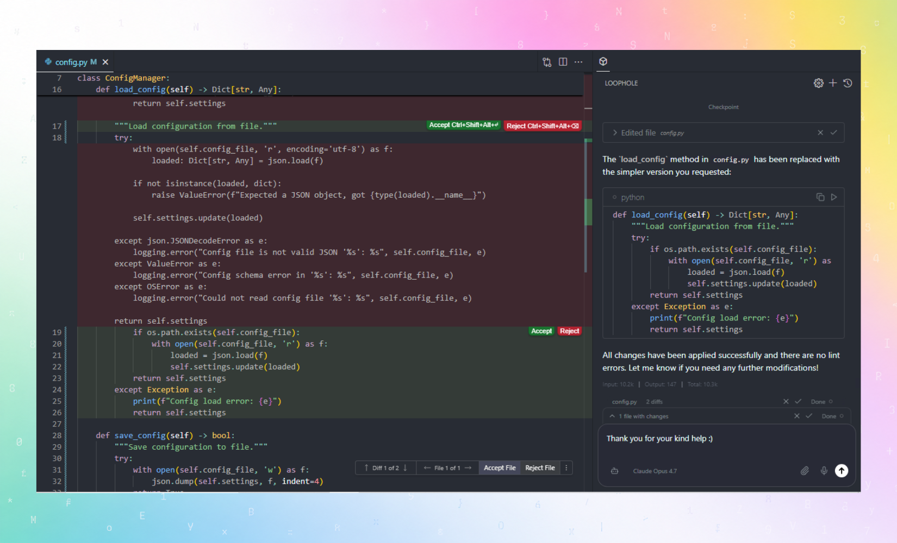

<p align="center">
  
</p>

<h1 align="center">Loophole</h1>

<p align="center">
The open-source AI code editor that thinks while you code.
</p>

<div align="center">


</div>

<div align="center">

<div align="center">
<table>
<tbody>
<td align="center">
<a href="https://github.com/loophole-ai/loophole-ide" target="_blank"><strong>GitHub</strong></a>
</td>
<td align="center">
<a href="./LOOPHOLE_CODEBASE_GUIDE.md" target="_blank"><strong>Documentation</strong></a>
</td>
<td align="center">
<a href="./HOW_TO_CONTRIBUTE.md" target="_blank"><strong>Contributing</strong></a>
</td>
<td align="center">
<a href="https://github.com/loophole-ai/loophole-ide/issues" target="_blank"><strong>Issues</strong></a>
</td>
<td align="center">
<a href="https://github.com/loophole-ai/loophole-ide/discussions" target="_blank"><strong>Discussions</strong></a>
</td>
</tbody>
</table>
</div>

</div>

<br>

<p align="center">
  
</p>

<p align="center">
  
</p>

---

## Overview

Loophole is an open-source AI code editor built on top of the Void editor (a fork of VS Code). It integrates AI features directly into the core editor experience with a focus on privacy, flexibility, and a premium user experience.

## Features

**AI Chat Sidebar** - Chat with your entire codebase using advanced AI models. Ask questions, get explanations, and receive code suggestions directly within the editor.

**Context Awareness** - Loophole understands your code structure and relationships. It provides intelligent suggestions based on your project's architecture and dependencies.

**Multiple AI Providers** - Connect to various AI providers or host your own. Loophole supports a wide range of models and services.

**Privacy First** - AI requests are sent directly from your machine to the provider. No intermediate servers store your data. Your code stays private.

**Built for Developers** - Forked from VS Code, Loophole maintains all the features you love while adding powerful AI capabilities.

---

## Supported AI Providers

| Provider | Models |
|----------|--------|
| Anthropic | Claude Opus, Sonnet, Haiku |
| OpenAI | GPT-4, GPT-4 Turbo, GPT-3.5 |
| Google | Gemini Pro, Gemini Ultra |
| DeepSeek | DeepSeek Coder, DeepSeek Chat |
| OpenRouter | 200+ models from any provider |
| Local Models | Ollama, vLLM, LM Studio |
| Other Providers | Groq, xAI, Mistral, Perplexity, and more |

---

## Installation

### Prerequisites

- Node.js version 22 or higher
- Python (required for some build tools)
- C++ build tools (required for native modules)

### Build from Source

```bash
# Clone the repository
git clone https://github.com/loophole-ai/loophole-ide.git
cd loophole-ide

# Install dependencies
npm install

# Build UI components
npm run buildreact

# Compile and run (in separate terminals)
npm run watch
npm run electron
```

---

## Project Structure

Loophole maintains the VS Code architecture while adding AI-specific layers:

- `src/vs/` - Main VS Code source code
- `extensions/` - Built-in extensions
- `build/` - Build scripts and configuration
- `resources/` - Static resources

For a detailed technical overview, see the [Loophole Codebase Guide](./LOOPHOLE_CODEBASE_GUIDE.md).

---

## Contributing

We welcome contributions from the community. Please read our [Contributing Guide](./HOW_TO_CONTRIBUTE.md) to get started.

---

## Documentation

- [Loophole Codebase Guide](./LOOPHOLE_CODEBASE_GUIDE.md) - Technical overview and architecture
- [How to Contribute](./HOW_TO_CONTRIBUTE.md) - Contribution guidelines
- [Security Policy](./SECURITY.md) - Security reporting and best practices
- [License](./LICENSE.txt) - AGPL-3.0 license

---

## License

Loophole is licensed under the GNU Affero General Public License v3.0 (AGPL-3.0).

This project incorporates code from:
- [Loophole](https://github.com/loophole-ai/loophole-ide) - Loophole is a fork of Void Editor, which is a fork of VS Code
- [Void Editor](https://github.com/voideditor/void) - Apache License 2.0
- [VS Code](https://github.com/microsoft/vscode) - MIT License

See [LICENSE.txt](./LICENSE.txt) for the full license text.

---

<div align="center">

**Garv Agnihotri** — Open Source • Privacy-First AI Editor

</div>
